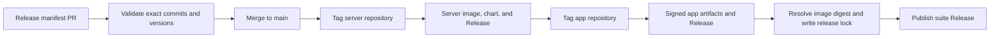

# SyncTV Release

This repository coordinates tested releases across
[`zijiren233/synctv`](https://github.com/zijiren233/synctv) and
[`zijiren233/synctv-app`](https://github.com/zijiren233/synctv-app).

Each component repository owns its build, signing, package publication, and
GitHub Release. This repository owns release intent, cross-repository
orchestration, immutable artifact resolution, and the final suite Release.

## Release model



A release is authorized by adding exactly one immutable manifest under
`releases/` and merging it to `main`. The orchestrator creates component tags,
waits for their existing workflows, and publishes `release-lock.yml` as the
suite Release record. It performs no Rust or Flutter compilation.

## Prepare a release

1. Copy `examples/release.yml` to `releases/YYYY.MM.PATCH.yml`.
2. Set each component to a full 40-character commit SHA.
3. Set versions and tags to the metadata already committed at those SHAs.
4. Open a pull request and wait for `Validate release manifests`.
5. Merge the pull request to authorize promotion.

Run the same validation locally:

```bash
make validate
```

The workflow produces three public records:

- Server Release, container image digest, and Helm chart.
- App Release and its platform artifacts.
- Suite Release containing the resolved lock and links to both components.

## Repository configuration

Create a GitHub App installed on `synctv`, `synctv-app`, and this repository.
Grant it `Contents: Read and write` and `Actions: Read`. Configure these
repository secrets:

| Secret | Purpose |
| --- | --- |
| `RELEASE_APP_ID` | GitHub App ID |
| `RELEASE_APP_PRIVATE_KEY` | GitHub App private key |

Create a `release` GitHub Environment for optional approval and restrict
deployment to `main`. Component signing and store credentials remain in their
own repositories.

See [the runbook](docs/runbook.md) for retries and recovery, and
[ADR-0001](docs/decisions/0001-release-orchestration.md) for the production
patterns behind this design.

